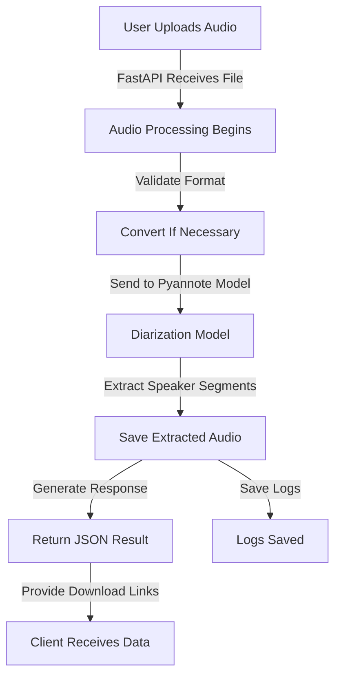

# 📖 EmmaWave Developer Documentation

## 📌 Overview

**EmmaWave** is a FastAPI-based application that performs **Speaker Diarization**, meaning it can detect and separate different speakers in an audio file. It uses **Pyannote-Audio**, a Hugging Face-based deep learning model, to achieve accurate speaker detection.

### 🚀 Features

- **📂 Upload Audio Files:** Users can upload `.wav` files for analysis.
- **🎙️ Speaker Identification:** Detects and separates speakers in an audio file.
- **🔗 Hugging Face Model:** Utilizes `pyannote/speaker-diarization` for speaker recognition.
- **🖥️ API Endpoints:** Provides REST API for audio processing.
- **📤 Log Management:** Saves logs asynchronously for analysis.
- **🔥 GPU Acceleration:** Supports CUDA for faster processing if a GPU is available.

---

## 🛠️ Installation Guide

### **Step 1: Update & Install System Packages**

On a fresh **Ubuntu 24 LTS** installation, run:

```bash
sudo apt update && sudo apt upgrade -y
sudo apt install python3 python3-pip python3-venv git ffmpeg
```

- `python3, pip3, venv`: Required for running the app.
- `git`: Required if cloning from a repository.
- `ffmpeg`: Used for audio processing.

### **Step 2: Clone the Project (If Hosted on GitHub)**

```bash
git clone https://github.com/your-repo/emmawave.git
cd emmawave
```

### **Step 3: Create a Virtual Environment**

```bash
python3 -m venv pyannote-env
source pyannote-env/bin/activate
```

### **Step 4: Install Python Dependencies**

```bash
pip install -r requirements.txt
```

This installs:

- **FastAPI & Uvicorn** (for running the server)
- **Pyannote-Audio** (for speaker diarization)
- **Torch & Torchaudio** (for deep learning inference)
- **Soundfile, FFmpeg-Python, and NumPy** (for audio processing)

### **Step 5: Configure Environment Variables**

Copy the example `.env` file and modify it:

```bash
cp .env_example .env
nano .env
```

Modify the following values:

```ini
HUGGING_FACE_ACCESS_TOKEN="YOUR_ACCESS_TOKEN"
SERVER_IP="0.0.0.0"
ENABLE_LOGGING=true
USE_GPU=true
```

Ensure you replace `YOUR_ACCESS_TOKEN` with a valid Hugging Face API token.

---

## 🚀 Running the Application

### **Step 1: Activate the Virtual Environment**

```bash
source pyannote-env/bin/activate
```

### **Step 2: Start the Server**

```bash
uvicorn app.main:app --host 0.0.0.0 --port 7000 --reload
```

- `--host 0.0.0.0` allows external access.
- `--port 7000` sets the server port.
- `--reload` enables automatic reloading during development.

### **Step 3: Test API Endpoints**

#### **1. Upload an Audio File**

```bash
curl -X POST -F "file=@/path/to/audio.wav" http://127.0.0.1:7000/diarize/
```

#### **2. Fetch Logs**

```bash
curl http://127.0.0.1:7000/logs/
```

---

## 🏗️ Application Workflow Diagram



---

## 📁 File Structure & Explanation

```
root/
├── app/
│   ├── main.py               # FastAPI main server file
│   ├── routes/               # API endpoints
│   │   ├── audio.py          # Serve audio files
│   │   ├── diarization.py    # Speaker diarization endpoint
│   │   ├── logs.py           # Log management endpoint
│   │   ├── health.py         # Health check API
│   ├── services/             # Core logic modules
│   │   ├── diarization_service.py  # Speaker diarization logic
│   │   ├── logging_service.py      # Logging operations
│   ├── utils/                # Helper modules
│   │   ├── audio_utils.py    # Audio processing functions
│   │   ├── config.py         # Configuration settings
│   │   ├── exceptions.py     # Custom error handling
│   │   ├── logging_utils.py  # System logging & metrics
├── .env                      # Environment variables
├── requirements.txt           # Python dependencies
└── README.md                  # Project documentation
```

---

## 📄 Detailed File Explanations

### **1️⃣ `main.py` (FastAPI Server Initialization)**

Handles:

- Middleware setup (CORS)
- Route registration
- Running the Uvicorn server

#### **Snippet**:

```python
app = FastAPI()
app.add_middleware(CORSMiddleware, allow_origins=["*"], allow_methods=["*"], allow_headers=["*"], allow_credentials=True)
```

---

### **2️⃣ `diarization_service.py` (Speaker Diarization Logic)**

- Loads `pyannote/speaker-diarization` model.
- Processes the audio file and extracts speaker segments.

#### **Snippet**:

```python
self.pipeline = Pipeline.from_pretrained("pyannote/speaker-diarization", use_auth_token=get_huggingface_token())
```

---

### **3️⃣ `audio_utils.py` (Audio Processing Helper)**

Handles:

- **Conversion to 16-bit PCM, 16kHz mono** (if needed).
- **Extracting speaker segments** from original audio.

#### **Snippet**:

```python
def convert_audio_format(audio_data, sample_rate):
    if sample_rate == 16000 and audio_data.ndim == 1:
        return audio_data
    output, _ = (
        ffmpeg.input("pipe:0", format="s16le", ar=str(sample_rate))
        .output("pipe:1", format="wav", ar="16000", ac="1")
        .run(input=audio_data.tobytes(), capture_stdout=True)
    )
    return np.frombuffer(output, dtype="int16")
```
